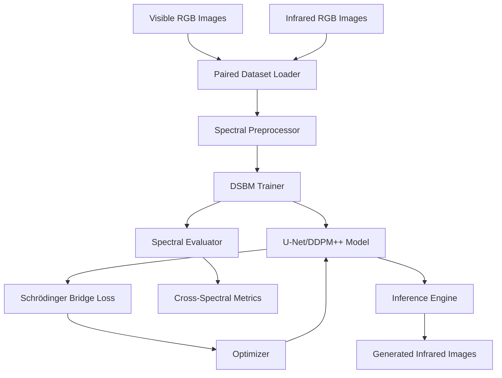

# Design Document

## Overview

This design implements a Schrödinger Bridge-based system for visible light RGB to infrared RGB image translation. The system leverages the existing DSBM (Diffusion Schrödinger Bridge Matching) framework while introducing specialized components for cross-spectral image translation. The design emphasizes modularity through a clean separation between dataset handling and core functionality, enabling easy integration of different visible-to-infrared paired datasets.

The system builds upon the proven IPF_DBDSB trainer architecture, extending it with spectral-aware preprocessing, evaluation metrics, and inference capabilities specifically designed for visible-to-infrared translation tasks.

## Architecture

### High-Level Architecture



### Component Architecture

The system consists of four main architectural layers:

1. **Data Layer**: Handles paired visible-infrared dataset loading and preprocessing
2. **Model Layer**: Implements the neural network architectures for spectral translation
3. **Training Layer**: Manages the DSBM training process with spectral-specific optimizations
4. **Evaluation Layer**: Provides comprehensive metrics for cross-spectral translation quality

## Components and Interfaces

### 1. Paired Dataset Interface

#### Base Class: `PairedSpectralDataset`
```python
class PairedSpectralDataset(torch.utils.data.Dataset):
    def __init__(self, root_dir, transform=None, target_transform=None):
        pass
    
    def __getitem__(self, index) -> Tuple[torch.Tensor, torch.Tensor]:
        # Returns (visible_rgb, infrared_rgb) pair
        pass
    
    def get_metadata(self, index) -> Dict:
        # Returns metadata like capture conditions, timestamps
        pass
```

#### Concrete Implementation: `VisibleInfraredDataset`
```python
class VisibleInfraredDataset(PairedSpectralDataset):
    def __init__(self, root_dir, visible_subdir="visible", infrared_subdir="infrared", 
                 image_size=256, transform=None, target_transform=None):
        # Handles directory structure: root_dir/{visible_subdir,infrared_subdir}/
        pass
```

### 2. Spectral Preprocessing Module

#### `SpectralPreprocessor`
```python
class SpectralPreprocessor:
    def __init__(self, visible_norm_params=None, infrared_norm_params=None):
        # Handles domain-specific normalization
        pass
    
    def preprocess_visible(self, image: torch.Tensor) -> torch.Tensor:
        # Normalize visible spectrum images to [-1, 1]
        pass
    
    def preprocess_infrared(self, image: torch.Tensor) -> torch.Tensor:
        # Normalize infrared spectrum images to [-1, 1]
        pass
    
    def postprocess_infrared(self, image: torch.Tensor) -> torch.Tensor:
        # Convert generated infrared back to [0, 255] range
        pass
```

### 3. Extended DSBM Trainer

#### `SpectralDBDSBTrainer(IPF_DBDSB)`
```python
class SpectralDBDSBTrainer(IPF_DBDSB):
    def __init__(self, visible_ds, infrared_ds, spectral_preprocessor, args, **kwargs):
        # Extends IPF_DBDSB for spectral translation
        pass
    
    def compute_spectral_loss(self, pred_infrared, target_infrared, timestep):
        # Spectral-aware loss computation
        pass
    
    def generate_infrared_samples(self, visible_batch, num_steps=None):
        # Generate infrared images from visible inputs
        pass
```

### 4. Spectral Evaluation Module

#### `SpectralEvaluator`
```python
class SpectralEvaluator:
    def __init__(self, device='cuda'):
        # Initialize evaluation metrics
        pass
    
    def compute_cross_spectral_metrics(self, generated_ir, target_ir, visible_input):
        # Returns: FID, LPIPS, PSNR, SSIM, spectral consistency metrics
        pass
    
    def generate_comparison_plots(self, visible, target_ir, generated_ir):
        # Create side-by-side visualizations
        pass
```

### 5. Configuration Integration

#### Dataset Configuration: `conf/dataset/visible_infrared.yaml`
```yaml
Dataset: visible_infrared
data:
  dataset: "VisibleInfrared"
  image_size: 256
  channels: 3
  visible_subdir: "visible"
  infrared_subdir: "infrared"

transfer: True
Dataset_transfer: infrared

# Spectral-specific parameters
spectral:
  visible_norm_mean: [0.485, 0.456, 0.406]
  visible_norm_std: [0.229, 0.224, 0.225]
  infrared_norm_mean: [0.5, 0.5, 0.5]
  infrared_norm_std: [0.5, 0.5, 0.5]
```

#### Model Configuration: `conf/model/spectral_unet.yaml`
```yaml
Model: UNET
model:
  num_channels: 128
  channel_mult: [1, 2, 2, 4]
  num_res_blocks: 2
  attention_resolutions: "32,16,8"
  dropout: 0.1
  use_checkpoint: False
  temb_scale: 1000
  
# Spectral-specific model parameters
spectral_features:
  cross_spectral_attention: True
  spectral_consistency_loss_weight: 0.1
```

## Data Models

### 1. Paired Image Data Structure
```python
@dataclass
class SpectralImagePair:
    visible: torch.Tensor  # Shape: (C, H, W), RGB visible image
    infrared: torch.Tensor  # Shape: (C, H, W), RGB infrared image
    metadata: Dict[str, Any]  # Capture conditions, timestamps, etc.
    
    def to_device(self, device):
        return SpectralImagePair(
            visible=self.visible.to(device),
            infrared=self.infrared.to(device),
            metadata=self.metadata
        )
```

### 2. Training Batch Structure
```python
@dataclass
class SpectralTrainingBatch:
    visible_batch: torch.Tensor  # Shape: (B, C, H, W)
    infrared_batch: torch.Tensor  # Shape: (B, C, H, W)
    timesteps: torch.Tensor  # Shape: (B,)
    noise: torch.Tensor  # Shape: (B, C, H, W)
```

### 3. Evaluation Results Structure
```python
@dataclass
class SpectralEvaluationResults:
    fid_score: float
    lpips_score: float
    psnr_score: float
    ssim_score: float
    spectral_consistency: float
    visual_samples: List[torch.Tensor]
    comparison_plots: List[str]  # File paths to saved plots
```

## Error Handling

### 1. Dataset Validation
- **Missing Paired Images**: Validate that each visible image has a corresponding infrared image
- **Size Mismatches**: Ensure visible and infrared images have compatible dimensions
- **Format Validation**: Check that images are in supported formats (PNG, JPG, TIFF)
- **Spectral Range Validation**: Verify that infrared images contain valid spectral information

### 2. Training Error Handling
- **Memory Management**: Implement gradient accumulation for large images that exceed GPU memory
- **Numerical Stability**: Add epsilon values to prevent division by zero in spectral normalization
- **Checkpoint Recovery**: Enable training resumption from checkpoints with spectral-specific state
- **Loss Divergence**: Monitor for loss explosion and implement adaptive learning rate scheduling

### 3. Inference Error Handling
- **Model Loading**: Validate that loaded models are compatible with spectral translation
- **Input Validation**: Ensure input visible images meet preprocessing requirements
- **Output Validation**: Check that generated infrared images are within valid ranges
- **Batch Processing**: Handle variable batch sizes and memory constraints during inference

## Testing Strategy

### 1. Unit Testing

#### Dataset Testing
```python
def test_paired_dataset_loading():
    # Test that visible-infrared pairs are correctly loaded
    # Verify image dimensions and data types
    # Check metadata extraction
    pass

def test_spectral_preprocessing():
    # Test normalization functions
    # Verify preprocessing/postprocessing invertibility
    # Check handling of edge cases
    pass
```

#### Model Testing
```python
def test_spectral_model_forward():
    # Test model forward pass with spectral inputs
    # Verify output dimensions and ranges
    # Check gradient flow
    pass

def test_spectral_loss_computation():
    # Test spectral-aware loss functions
    # Verify loss gradients
    # Check numerical stability
    pass
```

### 2. Integration Testing

#### End-to-End Training
```python
def test_spectral_training_pipeline():
    # Test complete training loop with small dataset
    # Verify checkpoint saving/loading
    # Check metric computation
    pass

def test_spectral_inference_pipeline():
    # Test inference on trained models
    # Verify output quality and consistency
    # Check batch processing
    pass
```

### 3. Performance Testing

#### Scalability Testing
- Test with different image resolutions (128x128, 256x256, 512x512)
- Benchmark training speed with different batch sizes
- Measure memory usage with large datasets
- Test multi-GPU training performance

#### Quality Testing
- Compare generated infrared images with ground truth using multiple metrics
- Test on diverse visible-infrared datasets
- Evaluate performance across different lighting conditions and scenes
- Measure spectral consistency and semantic preservation

### 4. Validation Testing

#### Cross-Dataset Validation
- Train on one visible-infrared dataset, test on another
- Evaluate domain transfer capabilities
- Test robustness to different capture conditions

#### Ablation Studies
- Test different network architectures (U-Net vs DDPM++)
- Compare different loss function combinations
- Evaluate impact of spectral-specific preprocessing

This comprehensive testing strategy ensures the reliability, performance, and quality of the visible-to-infrared translation system while maintaining compatibility with the existing DSBM framework.